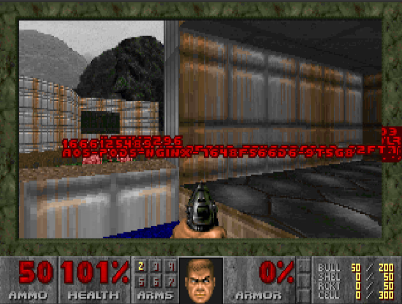

# kubedoom

The [kubedoom](https://github.com/storax/kubedoom) is a fun way to show the
self-healing capabilities of Kubernetes.

## Install
Please ensure that you are in the `kubedoom`folder and startup cluster and install kubedoom following these steps.

1. Create local [kind](https://kind.sigs.k8s.io/) cluster - on *nix run `./create_cluster.sh`
2. Deploy kubedoom
   ```console
   kubectl apply -k ./deploy
   ```

kubedoom should be running. To see what was created run `kubectl get all -n kubedoom` which
will show resources inside of the `kubedoom` namespace.

## Install "Demons"

The Kubernetes pods will show as demons which can be killed inside of the game. The following
command will start up some Kubernetes pods.

```console
kubectl apply -k ./demons
```

To see what was created run `kubectl get all -n demons`. 6 pods should be running or starting up.
It is possible to reduce or increase the number of demons by scaling the deployment.

## Play

A vnc client is needed to connect to the game and get started.

### MacOS
MacOS has built-in support for connecting to vnc servers.

1. Open "Finder"
2. Select "Go" -> "Connect to server"
3. Type `vnc://localhost:5900`

Password is `idbehold`

### Linux/Windows
Linux and Windows requires a separate vnc client to conenct to the game.

1. Install a vnc client, e.g., https://www.realvnc.com/en/connect/download/viewer/
2. Connect to `localhost:5900`

Password is `idbehold`


### Find some Demons

Now go find some pods.



Typing `idspispopd` will make it possible to go through the walls - the demons should
be to the right when starting the game. `idkfa` will supply extra weapons and more.

Possibly watch the `demons` namespace while playing seeing the pods being terminated.

```console
kubectl get pod -n demons --watch
```

## Takeways
 - it is possible to run Kubernetes on your local machine
 - you would be able to deploy this on a lot of other infrastructures including public cloud
 - whatever can be containerised can run inside a kubernetes cluster, however a lot needs
   to be added before having something that is ok for production use, which is a completly
   different set of workshops.
 - we see that kubernetes aims at keeping the number of pods at the defined level - this
   is called the reconcillilation loop - or "self healing"

[Read more](https://opensource.com/article/21/6/kube-doom)

Play away....

## Clean up
```console
./delete_cluster.sh
```
