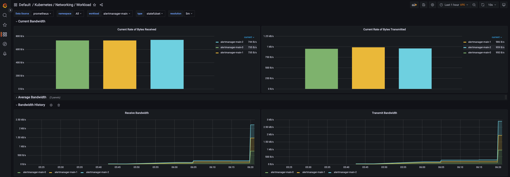
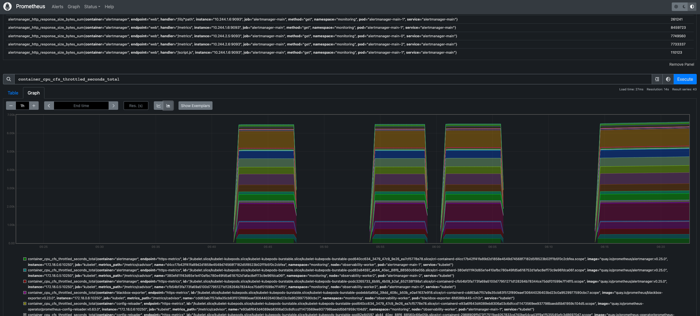
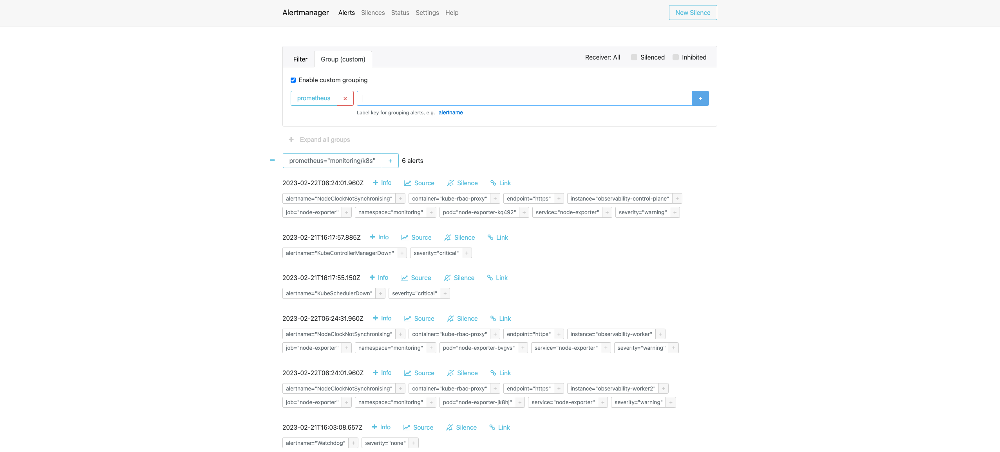

# Install observability stack on kubernetes
navigate to setup

install namespace
```bash
$ kubectl create -f ./namespace.yaml
```
get the installed namespaces
```bash
$ kubectl get namespaces
```
get the installed namespaces using a short form
```bash
$ kubectl get ns
```
get the installed namespace for kubedoom

```bash
$ kubectl get ns kubedoom
```
describe the installed namespace for kubedoom
```bash
$ kubectl describe ns kubedoom
```
describe the installed namespace for kubedoom as yaml
```bash
$ kubectl get ns kubedoom -o yaml
```
List the contents of the previously installed namesapce declaration
```bash
$ cat namespace.yaml
```
  > differences are runtime info added

## install operator
```bash
$ kubectl create -f setup
```
get the installed custom ressources 
```bash
$ kubectl get customresourcedefinition.apiextensions.k8s.io
$ kubenctl get customresourcedefinition.apiextensions.k8s.io/alertmanagers.monitoring.coreos.com -o yaml
````
describe one of the custom ressources 
```bash
$ kubectl describe customresourcedefinition.apiextensions.k8s.io/alertmanagers.monitoring.coreos.com
```

## install reminder
```bash
$ kubectl create -f install
```

## check running pods
```bash
$ kubectl get pods -n monitoring -w
```

## check servises
```bash
$ kubectl get svc -n monitoring
```

## access grafana 
```bash
$ kubectl --namespace monitoring port-forward svc/grafana 3000
````

http://localhost:3000
Username: admin
Password: admin (which you have to change on first login please change to admin2)


## access prometheus
```bash
$ kubectl --namespace monitoring port-forward svc/prometheus-k8s 9090
````

http://localhost:9090

## access alertmanager
```bash
$ kubectl --namespace monitoring port-forward svc/alertmanager-main 9093
```
http://localhost:9093

## why no data
When you look at the various dashboards you see that there are no data in them.
This is done to a set of network policies that are installed by default into the cluster.
These are useful objects and have a very significant impact on security in real clusters, 
this is however just a workshop and thus we remove them instead of working with them.
If you are on windows, you may not experience the same results.

### check network policies
```bash
$ kubectl get networkpolicies
```

### get rid of them now
```bash
$ kubectl -n monitoring delete networkpolicies.networking.k8s.io --all
```

Now there is data in the daskboards.







[Read More](https://computingforgeeks.com/setup-prometheus-and-grafana-on-kubernetes/)
